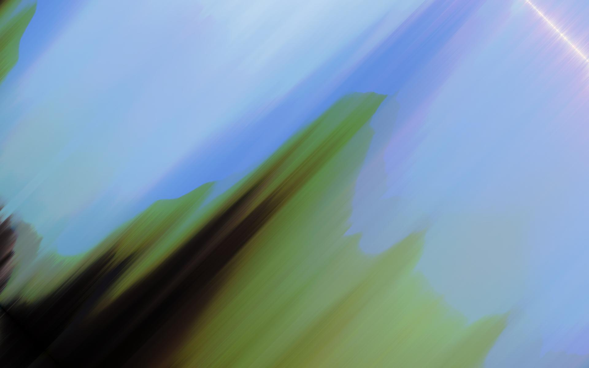

EvilFilter
==============================

EvilFilter is a fundamental package for insane image filters.

Sort Rotation
------------------------------
| |Original|Filter|
|:-:|-|-|
|`im_2d_sort`               |    | 
|`im_1d_sort`               |    | 
|`im_2d_rot_sort_v1`        |    | 
|`im_2d_rot_sort_v2`        |    | 
|`im_2d_rot_broken_sort_v1` |    | 

Sort Step
------------------------------
| |Original|Filter|
|:-:|-|-|
|`gen_bubble_sort_animation` |      |

Color Changer
------------------------------
| |Original|Filter|
|:-:|-|-|
|`color_rotation` |      |
|`color_replacer` |      |
|`color_restore` |      |